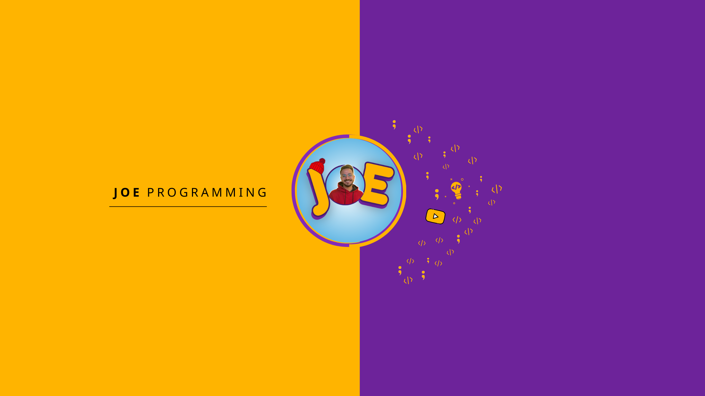

  

<h3 align="center">
Hi there, I'm <a href="https://www.youtube.com/channel/UCCxzov-Vf4YvDdnDrjsMtAw" target="_blank" rel="noreferrer">Yousef</a> 👋
</h3>

<h2 align="center">
I'm a Front-end Web Developer 💻, UI Designer  🎨!
</h2> 

I love the entire process of developing creative websites. I love the challenge of finding caches and spending time meeting new people. Learning how people hide things and where people are likely to look.

### 🤝 Connect with me:

 
- 💬 If you have any questions/feedback, please do not hesitate to reach out to me!

## 💼 Technical Skills

 

 

